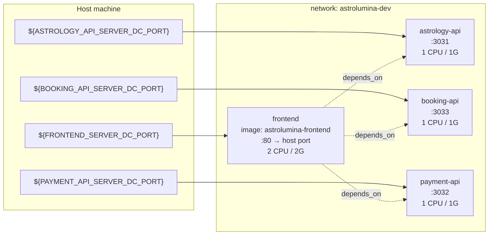
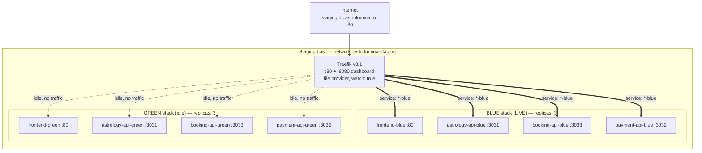
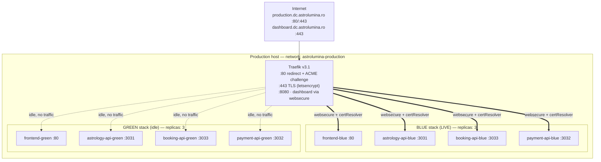
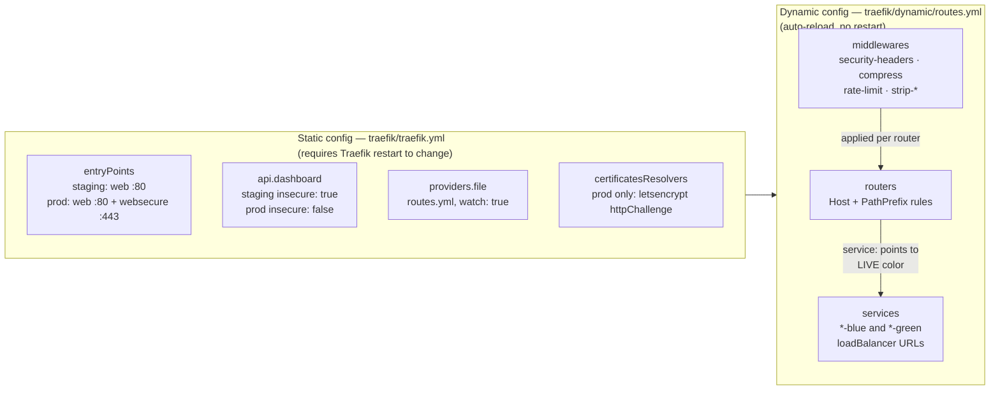
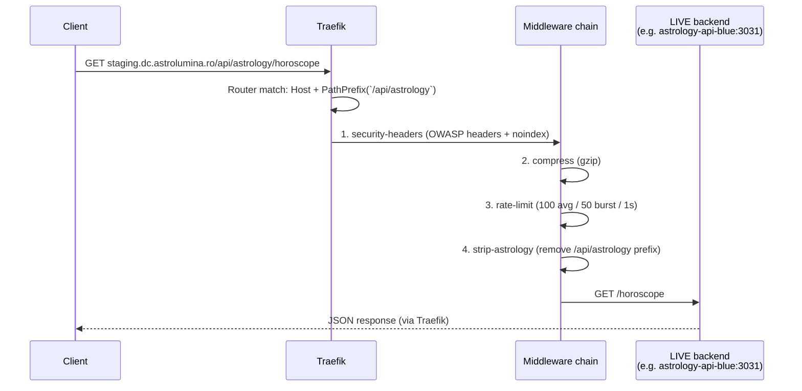
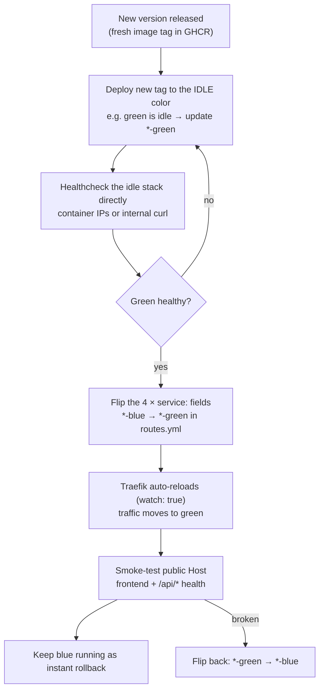
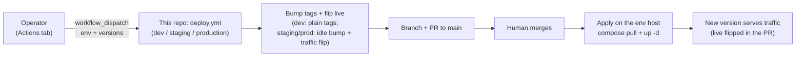

# AstroLumina — Docker Infrastructure

Docker Compose infrastructure for AstroLumina across three environments:
**development**, **staging**, and **production**. Application images are pulled
from GHCR (`ghcr.io/astrolumina-by-carmen-ilie`) — this repo contains only
orchestration: compose files, Traefik configs, env templates, and deploy workflows.

## Table of contents

1. [Repository layout](#1-repository-layout)
2. [Environments at a glance](#2-environments-at-a-glance)
3. [Architecture](#3-architecture)
4. [Services](#4-services)
5. [Traefik: static vs dynamic config](#5-traefik-static-vs-dynamic-config)
6. [Request flow](#6-request-flow)
7. [Blue-green deployments](#7-blue-green-deployments)
8. [CI/CD](#8-cicd)
9. [Configuration reference](#9-configuration-reference)
10. [Runbooks](#10-runbooks)
11. [Troubleshooting](#11-troubleshooting)

---

## 1. Repository layout

```mermaid
graph TD
    ROOT["AstroLumina-DockerCompose/"]
    ROOT --> DEV["development/"]
    ROOT --> STG["staging/"]
    ROOT --> PRD["production/"]
    ROOT --> GH[".github/workflows/"]
    ROOT --> SH["refresh.sh"]

    DEV --> DEV_C["docker-compose.yml<br/>4 services, direct ports,<br/>replicas: 1, no Traefik"]
    DEV --> DEV_E[".env.example"]

    STG --> STG_C["docker-compose.yml<br/>Traefik only (:80 + :8080)"]
    STG --> STG_B["docker-compose.blue.yml<br/>4 × *-blue services"]
    STG --> STG_G["docker-compose.green.yml<br/>4 × *-green services"]
    STG --> STG_T["traefik/<br/>traefik.yml + dynamic/routes.yml"]
    STG --> STG_E[".env.example"]

    PRD --> PRD_C["docker-compose.yml<br/>Traefik only (:80 + :443 + :8080)"]
    PRD --> PRD_B["docker-compose.blue.yml<br/>4 × *-blue services"]
    PRD --> PRD_G["docker-compose.green.yml<br/>4 × *-green services"]
    PRD --> PRD_T["traefik/<br/>traefik.yml + dynamic/routes.yml"]
    PRD --> PRD_E[".env.example<br/>+ TRAEFIK_DASHBOARD_AUTH"]

    GH --> GH_D["deploy.yml<br/>manual: env + versions"]
```



Each environment directory is self-contained: `cd` into it and run
`docker compose` there. The `.env` files are gitignored and contain secrets —
never commit them.

---

## 2. Environments at a glance

| Aspect | Development | Staging | Production |
|---|---|---|---|
| Compose files | `docker-compose.yml` | `docker-compose.yml` + `.blue.yml` + `.green.yml` | `docker-compose.yml` + `.blue.yml` + `.green.yml` |
| Reverse proxy | None (direct ports) | Traefik `:80` + dashboard `:8080` | Traefik `:80` + `:443` + dashboard `:8080` |
| TLS | No | No (HTTP only) | Yes (Let's Encrypt `httpChallenge`) |
| Replicas | 1 | 3 per service | 3 per service |
| Network | `astrolumina-dev` | `astrolumina-staging` | `astrolumina-production` |
| Host | `localhost` ports | `staging.dc.astrolumina.ro` | `production.dc.astrolumina.ro` |
| Dashboard | None | Open on `:8080` (`insecure: true`) | `dashboard.dc.astrolumina.ro` + basic auth |
| Deploy | Manual | `deploy.yml` (env + versions, branch + PR) | `deploy.yml` (env + versions, branch + PR) |

---

## 3. Architecture

### 3.1 Development — direct ports, no proxy

Four containers on one bridge network, each publishing its port to the host.
The frontend depends on the three APIs (`depends_on`).



### 3.2 Staging — Traefik (HTTP) + blue-green

Traefik is the only container with published ports. The blue and green stacks
run side by side (`expose` only, no `ports`); Traefik routes all traffic to
whichever color is **LIVE** in `traefik/dynamic/routes.yml`.



### 3.3 Production — Traefik (HTTPS) + blue-green

Same shape as staging, plus: `:443` with automatic Let's Encrypt certificates,
HTTP→HTTPS redirect, and an auth-protected dashboard on its own host.



---

## 4. Services

All four application services share the same structure in every environment;
only names, ports/publish mode, and replica counts differ.

| Service | Image (GHCR) | Container port | Dev publish | Staging/Prod |
|---|---|---|---|---|
| `frontend` | `astrolumina-frontend` | 80 | `${FRONTEND_SERVER_DC_PORT}:80` | `expose: 80` (Traefik only) |
| `astrology-api` | `astrolumina-astrologyapi` | 3031 | `${ASTROLOGY_API_SERVER_DC_PORT}:3031` | `expose: 3031` |
| `booking-api` | `astrolumina-bookingapi` | 3033 | `${BOOKING_API_SERVER_DC_PORT}:3033` | `expose: 3033` |
| `payment-api` | `astrolumina-paymentapi` | 3032 | `${PAYMENT_API_SERVER_DC_PORT}:3032` | `expose: 3032` |

Resource budgets (identical in all environments):

| Service | Limits | Reservations |
|---|---|---|
| frontend | 2 CPU / 2G RAM | 0.5 CPU / 512M RAM |
| each API | 1 CPU / 1G RAM | 0.125 CPU / 128M RAM |

> **Memory units:** this repo uses `G`/`M` (e.g. `memory: 2G`). Docker Compose
> interprets these as **1024-based** (2G = 2147483648 bytes — verified via
> `docker compose config`). Note this differs from Kubernetes, where `G`/`M`
> are decimal (1000-based) and you would need `Gi`/`Mi` for the same values.

Every service pulls on every start (`pull_policy: always`), restarts
automatically (`restart: unless-stopped`), and has a `wget --spider`
healthcheck (5m interval, 10s timeout, 3 retries, 40s start period).

---

## 5. Traefik: static vs dynamic config



Key differences between staging and production static config:

| Setting | Staging `traefik.yml` | Production `traefik.yml` |
|---|---|---|
| Entrypoints | `web: :80` only | `web: :80` + `websecure: :443` |
| Dashboard API | `insecure: true` (open `:8080`) | `insecure: false` (via router + basic auth) |
| ACME resolver | None | `letsencrypt` (`httpChallenge` on `web`, storage `/certs/acme.json`) |
| Logs | JSON `traefik.log` + `access.log` | Same |

The dynamic `routes.yml` defines, per router: entrypoints, a
`Host(...) && PathPrefix(...)` rule, the middleware chain, and the `service:`
field that selects the **LIVE** color. Production additionally has a
`catch-http` router (`to-https` redirect), `tls.certResolver: letsencrypt` on
every router, and a `dashboard-auth` basic-auth middleware fed by
`${TRAEFIK_DASHBOARD_AUTH}` (generate with `htpasswd -nb admin PASSWORD`).

---

## 6. Request flow

How a request travels through Traefik to a backend (example: horoscope call).



API path mapping (same in staging and production, minus TLS):

| Public path | Middleware strips | Backend receives |
|---|---|---|
| `/api/astrology/*` | `/api/astrology` | `http://astrology-api-<color>:3031/*` |
| `/api/booking/*` | `/api/booking` | `http://booking-api-<color>:3033/*` |
| `/api/payment/*` | `/api/payment` | `http://payment-api-<color>:3032/*` |
| `/` (everything else) | — | `http://frontend-<color>:80` |

---

## 7. Blue-green deployments

Both app stacks always run, each pinned to its own tag
(`*_BLUE_DOCKER_IMAGE_TAG` / `*_GREEN_DOCKER_IMAGE_TAG` in `versions.env`).
Deploy goes to the idle color only; the switch is a **4-line edit** in
`traefik/dynamic/routes.yml` — Traefik reloads it automatically (`watch: true`),
no restart, near-zero downtime.



The four fields (staging example; production identical except host/TLS):

```yaml
service: astrology-blue # LIVE: change to astrology-green to switch
service: booking-blue   # LIVE: change to booking-green to switch
service: payment-blue   # LIVE: change to payment-green to switch
service: frontend-blue  # LIVE: change to frontend-green to switch
```

Rollback is the same edit in reverse — the old color keeps running until you
take it down, so recovery is one edit away.

---

## 8. CI/CD



**Inputs** — `environment` is required (`dev` / `staging` / `production`);
the four version texts (`frontend_version`, `astrology_version`,
`booking_version`, `payment_version`, `X.Y.Z` or `latest`) are optional, but
at least one must be set. Only components with a version are touched; on
staging/production the live color is detected from `routes.yml`, the idle
color tag is bumped, and traffic is flipped to it in the same PR
(see [section 7](#7-blue-green-deployments)).

After merge, apply on the env host (`compose pull + up -d` with the three
`-f` files on staging/production); traffic switches to the new version on
apply since live was already flipped in the PR. Smoke-test after apply;
rollback is a revert + re-apply. No secrets are needed by the workflow (same-repo `GITHUB_TOKEN`
opens the PR).

- `refresh.sh` (repo root) — local helper that runs `docker compose down`
  across the four app repos via Doppler; unrelated to server deploys.

---

## 9. Configuration reference

- **Env files:** copy `<env>/.env.example` to `<env>/.env` and fill in values.
  Every app variable (service `*_SERVER_PORT`, shared `*_SERVER_DC_PORT` /
  `*_DC_DNS` / `*_K8S_PORT` / `*_K8S_DNS` endpoint pairs, `*_SENTRY_DSN`,
  Stripe keys, R2/D1, Resend, CalCom, RapidAPI astrologer key, and the three
  frontend `_API_DC_URL` URLs) flows into the containers via `environment:`. `${VAR}` interpolation means a missing `.env` breaks
  `docker compose config` — that is expected, not a bug.
- **Image tags (`<env>/versions.env`, tracked in git):** the `*_DOCKER_IMAGE_TAG`
  values are config, not secrets — source of truth in git (4 vars in dev,
  8 per-color `*_BLUE/_GREEN_*` vars in staging/production for true
  blue-green). They must be
  **deleted from Doppler** after a one-time copy, otherwise Doppler silently
  wins (process env beats `.env` file in compose interpolation; `doppler run`
  never deletes file vars, it only overlays its own). Local flow:
  `set -a; source versions.env; set +a` then `doppler run -- docker compose …`.
  (Service-level `env_file` would NOT work for `image:` — interpolation happens
  at compose parse time, from process env.) Server flow is unchanged: deploy
  workflows pin explicit tags into the server `.env` via `sed`.
- **Production extra:** `TRAEFIK_DASHBOARD_AUTH` holds an `htpasswd`-generated
  `admin:<hash>` pair (keep the quotes in `.env`).
- **Networks:** one dedicated bridge per environment (`astrolumina-dev` /
  `-staging` / `-production`). Blue, green, and Traefik all share their env's
  network so Traefik reaches backends by service name (e.g.
  `http://frontend-blue:80`).
- **Only Traefik publishes ports** in staging/production. If an app service
  ever shows up under `ports:` there, that's a mistake — app services use
  `expose:` (container-network only).

---

## 10. Runbooks

```bash
# ── Development ─────────────────────────────────────────────
cd development
cp .env.example .env          # then fill in values
docker compose up --build -d
docker compose ps
curl http://localhost:${FRONTEND_SERVER_DC_PORT}
curl http://localhost:${ASTROLOGY_API_SERVER_DC_PORT}/health

# ── Staging / Production (Traefik + blue + green) ───────────
cd staging                    # or: production
cp .env.example .env          # then fill in values
docker compose -f docker-compose.yml \
               -f docker-compose.blue.yml \
               -f docker-compose.green.yml up -d
docker compose ps

# Verify routing
curl http://staging.dc.astrolumina.ro            # staging (HTTP)
curl https://production.dc.astrolumina.ro/api/astrology/health  # production (HTTPS)

# Validate config without starting anything
docker compose config | grep -E "replicas|memory|cpus"
```

**Switch LIVE color** (staging example): edit the four `service:` fields in
`staging/traefik/dynamic/routes.yml`, save, then verify — no restart needed:

```bash
curl http://staging.dc.astrolumina.ro/api/astrology/health
curl http://staging.dc.astrolumina.ro/api/booking/health
curl http://staging.dc.astrolumina.ro/api/payment/health
curl http://staging.dc.astrolumina.ro
```

---

## 11. Troubleshooting

| Symptom | Likely cause | Fix |
|---|---|---|
| `docker compose config` fails on missing variable | No `.env` file yet | Copy `.env.example` → `.env` and fill values |
| Container won't start | Image tag wrong / secret missing | `docker compose logs <service>` |
| 404 via Traefik, direct container OK | Router rule or `service:` typo in `routes.yml` | Check rules; Traefik dashboard `:8080` shows active routers |
| API gets `/api/astrology/...` unprefixed 404 | Missing `strip-*` middleware on router | Add `strip-astrology`/`strip-booking`/`strip-payment` |
| No HTTPS in production | ACME challenge failing | Check `/certs/acme.json` exists; port 80 reachable for `httpChallenge` |
| Dashboard asks for password (prod) | Expected — basic auth | Use credentials matching `TRAEFIK_DASHBOARD_AUTH` |
| CORS errors | `*_URL` / DNS vars mismatch | Align env URLs with the public host |
| Switch didn't take effect | Edited wrong file or indentation broke YAML | Validate YAML; confirm `watch: true` in `traefik.yml` |
